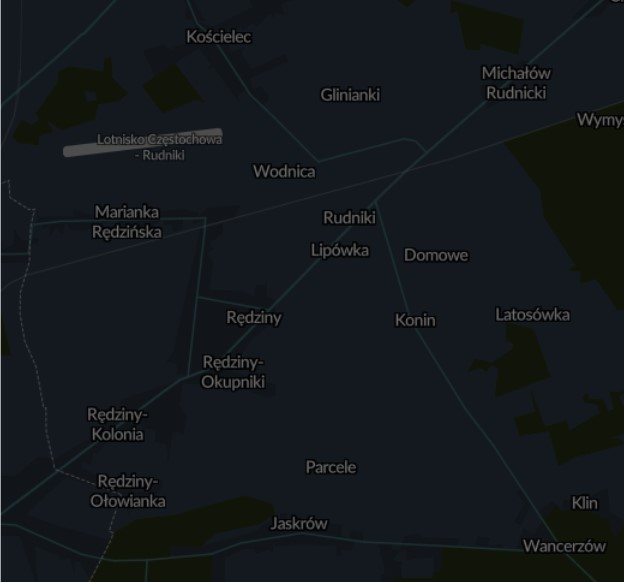
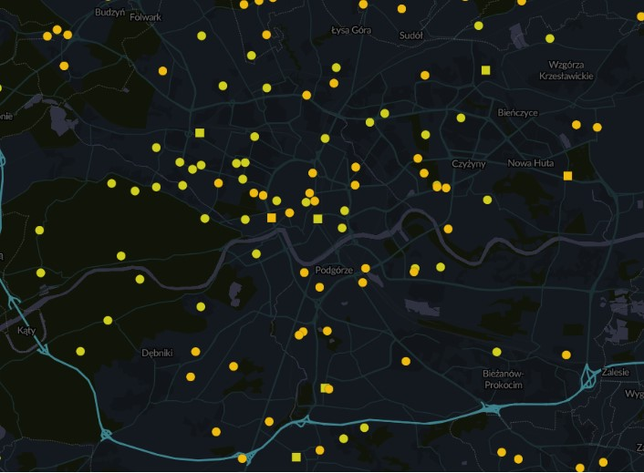
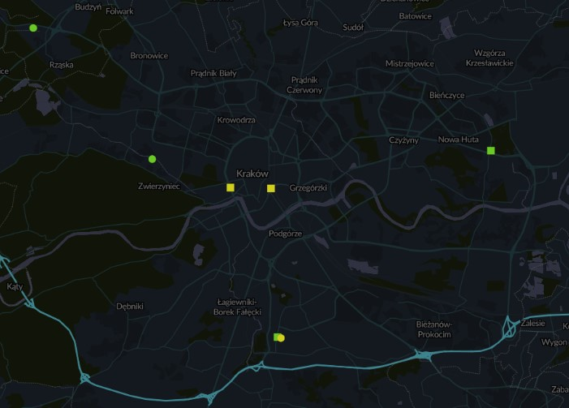
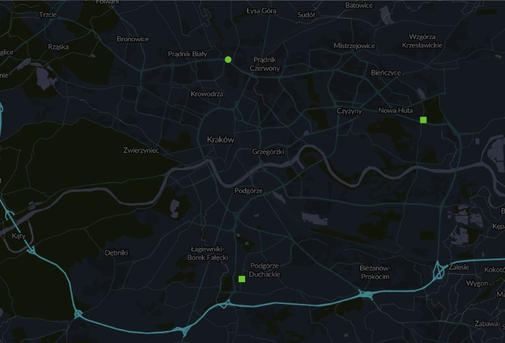

# Smogometr
Projekt zakłada stworzenie przenośnego miernika poziomu zanieczyszczeń komunikującego się  
z telefonem, wraz z aplikacją umożliwiającą analizę danych i bazą danych pozwalającą porównywać 
dane z serii urządzeń.
Powodem zainteresowania tematem było dużo zanieczyszczenie powietrza w mojej rodzinnej 
miejscowości, w której brak jest jakichkolwiek stacji pomiarowych (zrzut ekranu poniżej), a także 
widoczne zanieczyszczenie w obrębie zakorkowanych ulic w Krakowie. O ile w małych gminach i na 
terenach wiejskich za znaczną większość zanieczyszczeń odpowiada niska emisja (prawie połowa 
całkowitej emisji pyłu zawieszonego i ok 91% wielopierścieniowych węglowodorów aromatycznych 
m.in. benzo[a]piernu)1
, o tyle w miastach przeważa zanieczyszczenie z transportu zarówno 
publicznego jak i prywatnego (według raportu NIK w dużych miastach to nawet 75% stężenia 
średniorocznego dwutlenku azotu)
2
. Ponadto w przypadku czujników mierzący poziom 
zanieczyszczenia pyłami zawieszonymi w Krakowie ich ilość jest znaczna, tak w przypadku czujników 
mierzących poziomy tlenków azotu i siarki ich liczność jest minimalna(zrzuty ekranu poniżej).
Problemem jest także brak odpowiedniej ilości czujników w pobliżu ulic o zwiększonym ruchu
samochodowym. 
Przenośny smogometr zapewni nie tylko dokładniejsze miejscowe pomiary zanieczyszczeń, ale 
umożliwi także pomiar zanieczyszczeń w miejscu pracy, czy nauki. Według planów smogometr ma być 
przenośny i jak najmniejszy, tak aby można go było przypiąć do ubrania, czy plecaka. Połączenie z 
aplikacją i danymi GPS umożliwi nanoszenie danych pomiarowych na mapę i zwiększenie świadomości 
użytkowników o bliskości zanieczyszczeń. Poprzez nanoszenie punktów możliwe będzie wyznaczanie 
„czystszych” tras przemieszczania się. Jako urządzenie przenośne bez konieczności montażu będzie 
mógł dokonywać pomiarów w wielu miejscach, w przeciwieństwie do mierników stacjonarnych. 
Poniżej zaprezentowane zostały zrzuty ekranu z aplikacji Airly obrazujące sieć czujników 
podłączonych do serwisu. Pierwszy zrzut w Rędzinach i okolicy dotyczy wszystkich rodzajów czujników, 
natomiast kolejne pokazujące Kraków uwzględniają czujniki mierzące dane zanieczyszczenie.

PM, NO2, SO2

PM

NO2

SO2

Źródła:
1. https://polskialarmsmogowy.pl/smog/skad-sie-bierze-smog/
2. https://www.nik.gov.pl/aktualnosci/zabojczy-smog-z-samochodowych-spalin.html

