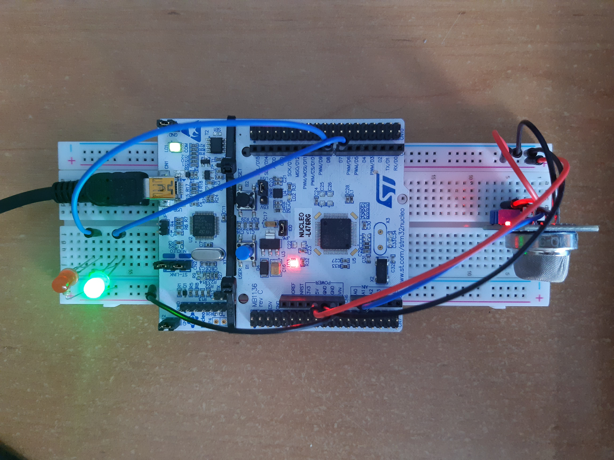
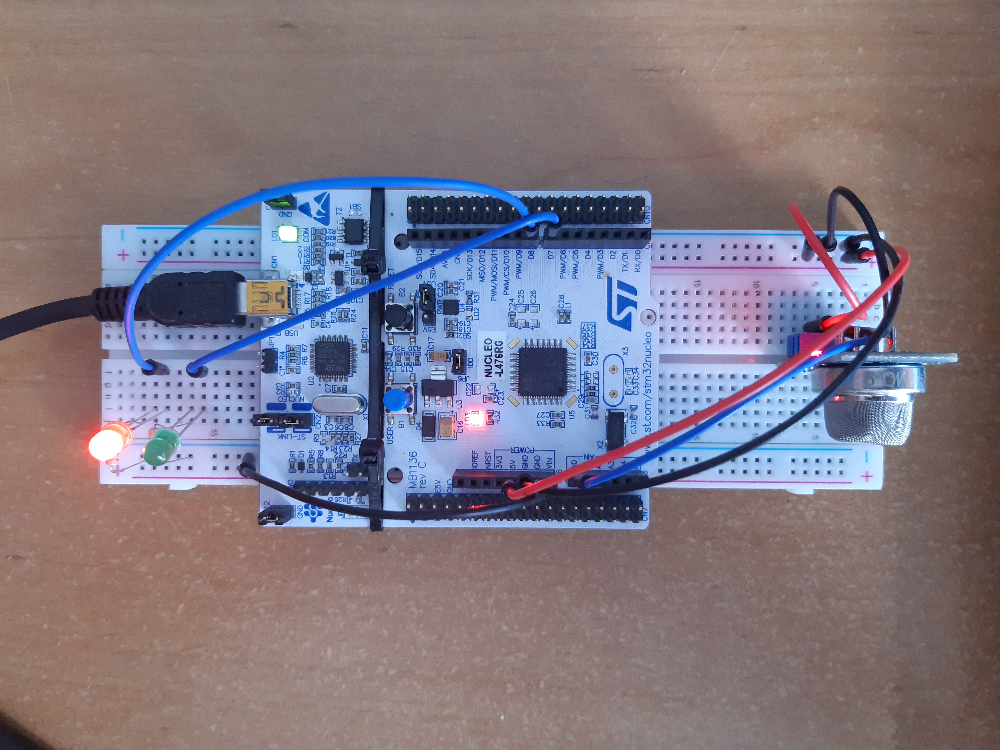
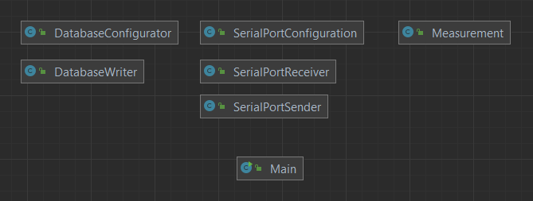
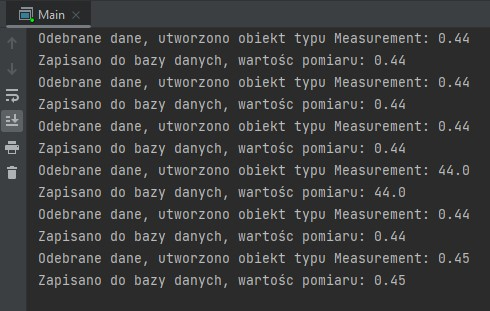
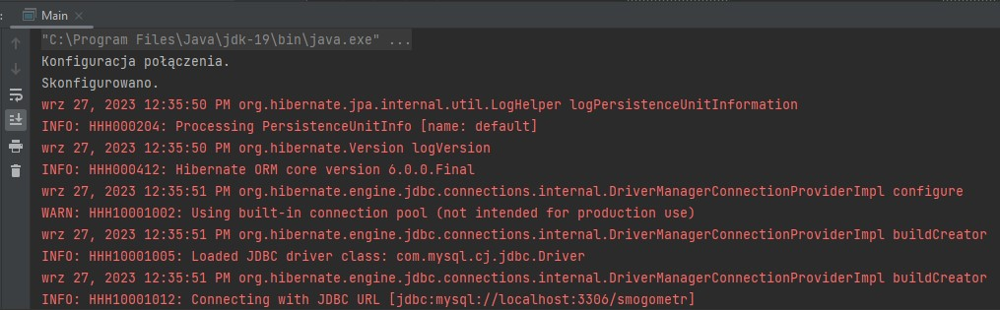
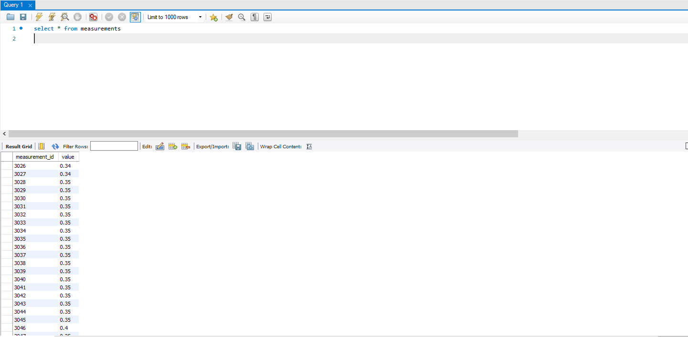
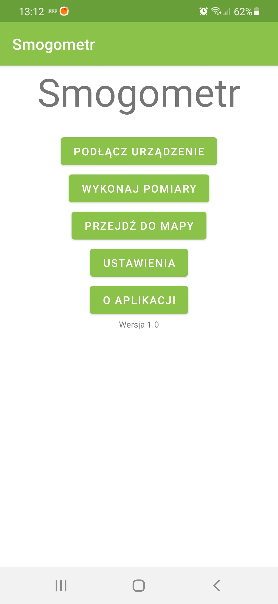
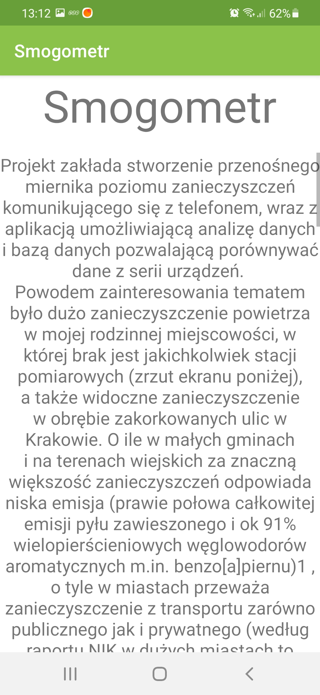
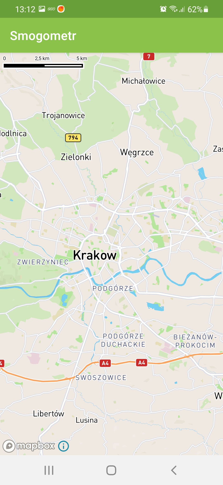

# Sprawozdanie z postępu prac przy Przenośnym Smogometrze
## 1. 
Na płytce stykowej połączono mikrokontroler STM Nucleo-L476RG, czujnik MQ9, oraz dwie diody sygnalizacyjne. Mikrokontroler posiada możliwość programowania zarówno jako kontroler STM, jak i kontroler Arduino, skorzystano z drugiej opcji i po odpowiedniej konfiguracji z wykorzystaniem środowiska Arduino zaimplementowano kod odpowiedzialny za oczekiwanie na sygnał wykonania pomiaru, dokonanie pomiaru(odczytanie wartości napięcia na wyjściu analogowym czujnika), i przesłanie wyniku w formie bitowe przez przewód USB(prgram miał na celu sprawdzenie możliwości przesyłania danych z mikrokontrolera do komputera, dlatego wybrano port szeregowy, w ostatecznej wersji będzie to komunikacja Bluetooth). Podłączenie diod LED umożliwiło weryfikację poprawności komunikacji(bardzo proste testowanie czy kontroler odbiera ustawiony komunikat i czy wysyła porcję danych)

Odbiór danych

Wysyłanie danych

## 2. 
Symetrczynym etapem było napisanie programu w Javie, który będzie wysyłał sygnał do wykonania pmiaru i odbierał strumień bajtów, a następnie wykonywał zapis danych do lokalnej bazy danych. W tym celu utworzono bazę danych wykorzystująć MYSQLWorkbench(tylko w celach testowcyh, finalna baza powinna mieć system logowania, weryfikacji i obsługi zapytań). Następnie przy wokorzystaniu Hibernate'a podłączono bazę do progrsmu i stworzono wielowątkową aplikację. Wydzielono wątek do wysyłania ustalonego kodu do mikrokontrolera w pewnych odstępach czasowych, utworzono takzę wątek do odbierania danych z portu szeregowego, tworzenia instancji obiektu typu Measurement(w wersji testowej jest to jedynie wartość pomiaru, jednak w wersji końcowej będzie to także lokalizacja i data wykonania pomiaru), oraz wątek odpowiedzialny za zapisywanie informacji do bazy danych.

Digram przedstawiający klasy zaimplementowane w programie, widok samych klas bez metod.

Fragment testowego wypisywania na ekran w trakcie działania programu, wartość w Voltach.

Fragment pokazujący konfigurację połączenia z Arduino i bazą danych

Sprawdzenie poprawnośi przesłania danych do bazy danych, wcześniej sprawdzano na inkrementowanych  wartościach zmienneh typu int, ponieważ czujnik wykonuje podobne odczyty.

Program znajduje się w folderze Smogometr_USB_DB_2_parallel.

## 3.
<<<<<<< HEAD
Kolejnym etapem było utworzenie apliakcji na Androida, która miała być wersją pokazowo/testową, udało się stworzyć prosty layout wraz z kilkoma aktywnościami, w aktywności About znajduje się opis całego projektu, natomiast w aktywności Przejdź do mapy udało się dodać mapę wykorzystując dostawcę MapBox(skorzystano z MapBox, ponieważ Google posiada podobne rozwiązania jednak jest ono objęte płątnym planem, a wersja testowa trwa zaledwie 90 dni, w przypadku MapBox jeżeli mapy są wykorzystywane przez mniej niż 25 000 urządzeń są całkowicie darmowe). Następnie testowano połacznenie aplikacji z ROOM, jednak na tym etapie nie udało się zaimplementować gotowego rozwiązania. Podjęto także testy z wykorzystaniem JetpackCOmpose jako obecnie zalecanej formy budowy aplikacji, podłączono ROOM, stworzono podstawowe operacje takie jak dodawanie rekordów i ich odczytywanie(apliakcja generuje wartosći zarówno pomiaru jak i daty, czy lokalizacji), jednak napotkano na błędy związane z brakiem kompatybilności wersji bibliotek. 
=======
Kolejnym etapem było utworzenie apliakcji na Androida, która miała być wersją pokazowo/testową, udało się stworzyć prosty layout wraz z kilkoma aktywnościami, w aktywności About znajduje się opis całego projektu, natomiast w aktywności Przejdź do mapy udało się dodać mapę wykorzystując dostawcę MapBox(skorzystano z MapBox, ponieważ Google posiada podobne rozwiązania jednak jest ono objęte płątnym planem, a wersja testowa trwa zaledwie 90 dni, w przypadku MapBox jeżeli mapy są wykorzystywane przez mniej niż 25 000 urządzeń są całkowicie darmowe). Następnie testowano połacznenie aplikacji z ROOM, jednak na tym etapie nie udało się zaimplementować gotowego rozwiązania. Podjęto także testy z wykorzystaniem JetpackCOmpose jako obecnie zalecanej formy budowy aplikacji, podłączono ROOM, stworzono podstawowe operacje takie jak dodawanie rekordów i ich odczytywanie(apliakcja generuje wartosći zarówno pomiaru jak i daty, czy lokalizacji), jednak napotkano na błędy związane z brakiem kompatybilności wersji biblitek. Pliki znajdują się w katalogu Android/Smogometr_1 pozostałe wersje apliakcji są niedokończone
>>>>>>> ebc23ba20685bd306b250207ad3a5650db9d7498

Zrzuty prezentujące apliakację w wersji z aktywnościami.

## 4.

Najbliższe etapy

- Dodanie usług GPS i możliwości lokalizacji użytkownika
- Stworzenie bazy danych na serwerze wraz z niezbędnym API
- Dalsze prace z mikrokontrolerem, integracja z docelowym czujnikiem
- Zmiana sposobu wymiany danych z USB na Bluetooth